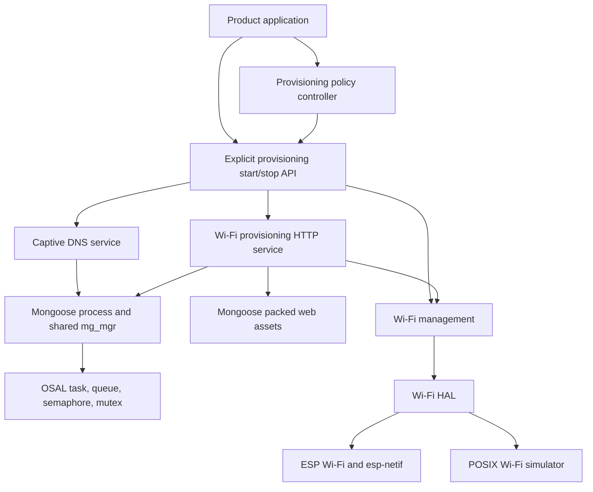
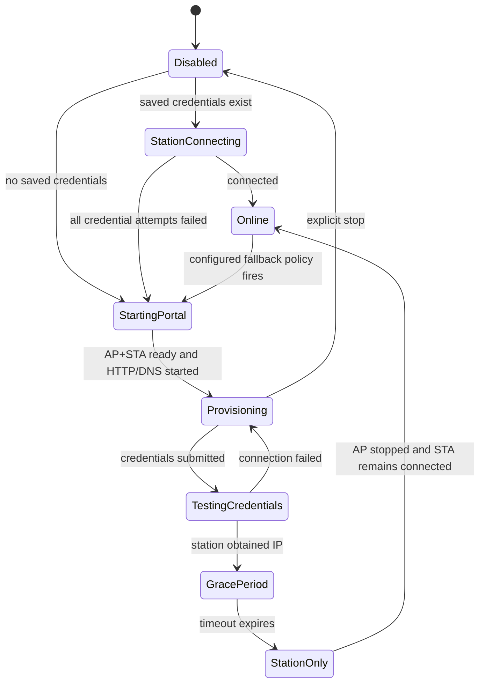

# Wi-Fi HTTP Provisioning Architecture and Implementation Plan

## 1. Purpose

Add an optional Wi-Fi provisioning application to `hq_platform` that:

- runs on the existing Mongoose event loop;
- uses OSAL and the platform Wi-Fi management API;
- exposes a redesigned browser UI and JSON API;
- provides captive-portal discovery through wildcard unicast DNS;
- supports explicit start/stop control and optional automatic fallback;
- runs on ESP32 and as a functional POSIX simulation;
- is removed from the build when `CONFIG_WIFI_HTTP_PROVISIONING=n`.

This document is an implementation plan. It does not implement the feature.

## 2. Existing Implementations

### 2.1 `hq_platform`

Relevant modules:

| Area | Existing implementation | Reuse decision |
|---|---|---|
| Mongoose | `src/mongoose/mongoose.c`, `mongoose_process.c` | Reuse the single `mg_mgr` and poll task. Do not create another Mongoose task. |
| OS abstraction | `src/osal/` | Use OSAL mutexes, semaphores, queues, tasks, timers, and logging. |
| Wi-Fi management | `src/wifi/wifi_managment.c` | Reuse AP, STA, AP+STA, async scan, connect, disconnect, status, and persistence behavior. |
| ESP Wi-Fi HAL | `src/wifi/platforms/esp/wifi_hal_driver.c` | Extend AP DHCP/DNS configuration only where platform behavior is required. |
| POSIX Wi-Fi HAL | `src/wifi/platforms/posix/wifi_hal_driver.c` | Reuse simulated networks and connection outcomes. |
| JSON | vendored cJSON | Build and parse API payloads with structured APIs. |
| Tests | Unity and CTest under `tests/` | Add focused DNS, provisioning HTTP, controller, and build-configuration tests. |

The Wi-Fi layer already supplies the main provisioning data as structured values:

- `wifi_mgmt_start_scan_no_block()`;
- `wifi_mgmt_get_access_points()`;
- `wifi_mgmt_set_ap_name()` and `wifi_mgmt_set_password()`;
- `wifi_mgmt_connect()` and `wifi_mgmt_disconnect()`;
- `wifi_mgmt_get_ip_info()`;
- AP+STA mode through `T_WIFI_TYPE_CLI_SER`;
- credential persistence after a successful connection.

The old JSON-buffer getters are not needed. JSON representation belongs to the HTTP provisioning application.

### 2.2 Original `bimbrownik` application

The original component is in:

- `components/wifi_http_app/src/wifi_http_app.c`;
- `components/wifi_http_app/src/index.html`;
- `components/wifi_http_app/src/code.js`;
- `components/wifi_http_app/src/style.css`.

It creates a dedicated FreeRTOS task and a private `mg_mgr`, listens on HTTP port 80, and implements:

| Method and path | Behavior |
|---|---|
| `GET /` | Return embedded HTML. |
| `GET /code.js` | Stream embedded JavaScript. |
| `GET /style.css` | Return embedded CSS. |
| `GET /ap.json` | Start an asynchronous scan and return the latest AP list. |
| `GET /status.json` | Return SSID, IP, netmask, gateway, and result code. |
| `POST /connect.json` | Read credentials from custom headers and start a connection. |
| `DELETE /connect.json` | Disconnect the station. |

The browser polls status every 950 ms and scans every 3.8 seconds. It supports selecting a scanned SSID, entering a hidden SSID, connecting, viewing IP data, and disconnecting.

The migration should preserve the useful workflow, not the old API or UI implementation. In particular, credentials should move from custom HTTP headers to a validated JSON request body.

### 2.3 When `bimbrownik` enables the application

The component is linked unconditionally by its ESP-IDF CMake files. Runtime enablement is controlled by `components/application/network_manager.c`:

1. `NetworkManagerInit()` starts the network manager.
2. If saved Wi-Fi data exists, the manager enters CLIENT mode and attempts station connection.
3. If no saved Wi-Fi data exists, it enters SERVER mode.
4. SERVER mode starts Wi-Fi as AP+STA and calls `WiFiHTTPApp_Start()`.
5. Client connection failure can transition back to SERVER mode.
6. After the station obtains an IP address in SERVER mode, a five-second timer requests CLIENT mode.
7. Transition to CLIENT mode calls `WiFiHTTPApp_Stop()`, stops AP+STA, and restarts client-only Wi-Fi.

There is no captive DNS server in the original component.

## 3. Dependency and Capability Gap Analysis

### 3.1 Required gaps

| Gap | Why it is needed | Planned owner |
|---|---|---|
| Wildcard unicast DNS responder | Captive clients must resolve arbitrary hostnames to the provisioning AP address. | New reusable Mongoose service. |
| AP DHCP DNS advertisement | ESP AP clients must be told to use the device IP as their DNS server. Listening on UDP 53 alone is insufficient. | Wi-Fi HAL configuration. |
| Mongoose-thread command execution | Listener creation and closure must occur on the Mongoose poll thread. | `mongoose_process` core. |
| Typed Wi-Fi events | Automatic fallback must distinguish connected, disconnected, connection failed, and scan completed. | Wi-Fi management core. |
| Event unsubscribe | Provisioning/controller shutdown must not leave callbacks registered. | Wi-Fi management core. |
| Synchronized snapshots | Mongoose reads scan/IP data while the Wi-Fi worker updates it. | Wi-Fi management core. |
| Runtime mode transition | Successful provisioning must switch AP+STA to STA without exposing a stale provisioning AP. | Wi-Fi management core using the existing HAL. |
| Portable embedded web assets | ESP `EMBED_FILES` does not provide the same mechanism on POSIX. | Provisioning CMake using Mongoose packed FS. |
| Captive-portal probe handling | Android, Apple, and Windows use known HTTP probe URLs. | Provisioning HTTP application. |

### 3.2 mDNS is not the missing DNS server

`struct mg_mdns_req` and `mg_mdns_listen()` implement multicast DNS/DNS-SD on UDP 5353 for `.local` names. Captive portal discovery requires normal unicast DNS on UDP 53 and wildcard A-record responses.

The project should still use Mongoose, but through:

- `mg_listen(mgr, "udp://0.0.0.0:53", ...)`;
- `MG_EV_READ`;
- `mg_dns_parse()` and `mg_dns_parse_rr()` for validated query parsing;
- `mg_send()` for the encoded DNS response.

Do not modify the vendored `mongoose.c` for this feature. Build the responder as a small reusable service around Mongoose's public networking and DNS parsing APIs.

### 3.3 POSIX runtime limitation

The POSIX Wi-Fi HAL simulates AP/STA state and networks but does not configure a real host access point or DHCP server. The POSIX provisioning application can still be fully exercised through local HTTP and DNS listeners against simulated Wi-Fi data.

Creating a real Linux AP would require a separate privileged backend using facilities such as NetworkManager or hostapd. That is outside this feature and must not leak direct Linux networking into the portable application.

## 4. Proposed Architecture



### 4.1 Ownership rules

- The product owns global `MongooseProcess_Init()` and `MongooseProcess_Deinit()` lifetime.
- Provisioning owns only its HTTP and DNS listener connections.
- Provisioning start/stop is serialized onto the Mongoose poll thread.
- The controller owns policy; the HTTP module does not decide when AP mode starts or stops.
- Wi-Fi management owns credentials, connection attempts, persistence, and mode changes.
- The HAL owns platform AP, DHCP, and network-interface details.
- The provisioning module owns API JSON and web presentation.

### 4.2 Proposed source layout

```text
src/
  mongoose/
    captive_dns_server.c
    captive_dns_server.h
    mongoose_process.c          # add poll-thread invocation API
    mongoose_process.h
  wifi/
    wifi_managment.c            # typed events, synchronization, mode request
    wifi_managment.h
    wifi_hal_driver.h           # optional AP DNS configuration
    platforms/esp/wifi_hal_driver.c
    platforms/posix/wifi_hal_driver.c
  wifi_provisioning/
    CMakeLists.txt
    Kconfig
    wifi_http_provisioning.c
    wifi_http_provisioning.h
    wifi_provisioning_controller.c
    wifi_provisioning_controller.h
    web/
      index.html
      app.css
      app.js
tests/
  mongoose/captive_dns_server_test.c
  wifi_provisioning/wifi_http_provisioning_test.c
  wifi_provisioning/wifi_provisioning_controller_test.c
```

## 5. Public Interfaces

Exact names may be adjusted to existing project naming conventions during implementation.

### 5.1 Mongoose process execution

Add a generic way to execute a callback on the Mongoose poll thread:

```c
typedef void (*mongoose_process_fn_t)(struct mg_mgr *mgr, void *context);

bool MongooseProcess_Invoke(mongoose_process_fn_t fn,
                            void *context,
                            uint32_t timeout_ms);
bool MongooseProcess_IsRunning(void);
```

Implementation direction:

- create a control connection before starting the poll task;
- queue fixed-size invocation records through OSAL;
- call `mg_wakeup()` to notify the control connection;
- execute queued callbacks from `MG_EV_WAKEUP` on the poll thread;
- use a completion semaphore only for synchronous start/stop calls;
- reject invocation during shutdown;
- preserve existing `MongooseProcess_Init/Deinit` behavior initially.

This replaces service-specific bootstrap tricks and prevents direct cross-thread mutation of `mg_mgr`.

### 5.2 Captive DNS service

```c
typedef struct {
    const char *listen_url;
    uint32_t ipv4_address;
    uint32_t ttl_seconds;
} captive_dns_server_config_t;

typedef struct captive_dns_server captive_dns_server_t;

bool captive_dns_server_start(captive_dns_server_t *server,
                              struct mg_mgr *mgr,
                              const captive_dns_server_config_t *config);
void captive_dns_server_stop(captive_dns_server_t *server);
```

Behavior:

- accept standard DNS QUERY packets with one question;
- answer Internet-class A queries for any valid name with the configured AP IPv4 address;
- return NOERROR with no answer for unsupported types such as AAAA;
- ignore malformed packets and unsupported opcodes;
- preserve transaction ID and the original question;
- set response and authoritative flags and use a bounded TTL;
- cap accepted packet sizes and never produce a response larger than the fixed output buffer;
- close only the service's own listener on stop.

### 5.3 Wi-Fi management extensions

Replace or supplement callback-without-data registration with a typed subscription API:

```c
typedef enum {
    WIFI_MGMT_EVENT_CONNECTED,
    WIFI_MGMT_EVENT_DISCONNECTED,
    WIFI_MGMT_EVENT_CONNECT_FAILED,
    WIFI_MGMT_EVENT_SCAN_COMPLETED,
    WIFI_MGMT_EVENT_MODE_CHANGED,
} wifi_mgmt_event_t;

typedef void (*wifi_mgmt_event_callback_t)(wifi_mgmt_event_t event,
                                           void *user_data);

bool wifi_mgmt_subscribe(wifi_mgmt_event_callback_t callback,
                         void *user_data);
bool wifi_mgmt_unsubscribe(wifi_mgmt_event_callback_t callback,
                           void *user_data);
bool wifi_mgmt_request_mode(wifi_type_t mode);
```

Also protect scan records, station status, and callback lists with OSAL synchronization. Snapshot getters must copy consistent data and must not expose internal mutable buffers.

Mode changes remain implemented through the HAL's existing stop/start operations. The request is asynchronous so the caller never blocks the Mongoose event loop.

### 5.4 Provisioning application

```c
typedef enum {
    WIFI_PROVISIONING_STOPPED,
    WIFI_PROVISIONING_STARTING,
    WIFI_PROVISIONING_RUNNING,
    WIFI_PROVISIONING_STOPPING,
    WIFI_PROVISIONING_ERROR,
} wifi_http_provisioning_state_t;

bool wifi_http_provisioning_start(void);
bool wifi_http_provisioning_stop(void);
wifi_http_provisioning_state_t wifi_http_provisioning_get_state(void);
```

Start is idempotent and succeeds only when Mongoose and Wi-Fi management are initialized. Stop closes HTTP and DNS listeners, unregisters callbacks, clears sensitive temporary credential data, and does not deinitialize the global Mongoose process.

## 6. HTTP API and Portal Design

### 6.1 JSON API

| Method and path | Request | Response |
|---|---|---|
| `GET /api/v1/wifi/status` | none | Provisioning state, Wi-Fi state, SSID, IP data, and last failure category. Never return a password. |
| `POST /api/v1/wifi/scans` | none | `202 Accepted`; starts an async scan or reports that one is active. |
| `GET /api/v1/wifi/networks` | none | Latest scan generation, scan state, and AP records. |
| `POST /api/v1/wifi/credentials` | `{"ssid":"...","password":"..."}` | `202 Accepted`; validates and starts an async connection attempt. |
| `DELETE /api/v1/wifi/connection` | none | `202 Accepted`; requests disconnect. |

API rules:

- use `Content-Type: application/json`;
- parse bodies with cJSON and enforce body-size limits;
- validate SSID/password byte lengths against Wi-Fi limits;
- allow an empty password for open networks;
- reject embedded NUL values and malformed UTF-8 policy violations consistently;
- return stable JSON error codes and appropriate HTTP status codes;
- set `Cache-Control: no-store` for API responses;
- never log credentials or include them in responses;
- keep handlers non-blocking.

### 6.2 Captive portal HTTP behavior

- Serve `/`, `/app.css`, and `/app.js` from Mongoose packed FS.
- Redirect unknown browser routes to `http://<AP-IP>/` while provisioning is active.
- Handle common captive checks, including Android `generate_204`, Apple `hotspot-detect.html`, and Windows `ncsi.txt`/`connecttest.txt`, with responses that cause the OS captive assistant to open.
- Do not attempt HTTPS interception. TLS certificate mismatch makes transparent HTTPS capture invalid.
- Return `405` with `Allow` for unsupported methods.
- Add content-type, cache, and basic security headers.

### 6.3 Redesigned browser workflow

The new portal should be a small, dependency-free application optimized for mobile captive browsers:

1. Show scanning state and available networks.
2. Allow manual hidden-SSID entry.
3. Ask for credentials without retaining the password after submission.
4. Show connection progress from status polling.
5. Show actionable failure state and allow retry without reloading.
6. Show connected network and IP details.
7. Allow explicit disconnect or portal close where policy permits.

Use semantic HTML, keyboard-accessible controls, visible focus states, and responsive layout. Avoid external fonts, scripts, images, or CDNs because the client has no Internet access during provisioning.

### 6.4 Asset generation

Use Mongoose packed FS for both ESP and POSIX:

- build the vendored `third_party/mongoose/test/pack.c` utility for the host;
- generate `packed_fs.c` from `src/wifi_provisioning/web/` during CMake configuration/build;
- compile generated output only into the provisioning target;
- enable `MG_ENABLE_PACKED_FS` consistently when provisioning is enabled;
- do not commit generated build output.

This avoids ESP-only linker symbols and gives both targets identical assets.

## 7. Lifecycle and State Design

### 7.1 Explicit control

The product may call start/stop directly. This is required for button-triggered provisioning, factory setup, maintenance mode, and product-specific policies.

### 7.2 Automatic fallback controller

The optional controller uses the same public start/stop API:



Recommended default policy:

- start automatically when no saved credential exists;
- start after all saved credentials fail, not after a single transient disconnect;
- use AP+STA while testing credentials;
- after station success, keep the portal for a configurable grace period;
- then stop HTTP/DNS and transition to STA-only mode;
- do not automatically reopen provisioning on every network loss;
- expose a product callback for success, failure, start, and stop.

## 8. Kconfig and Build Integration

### 8.1 Kconfig

Add `src/wifi_provisioning/Kconfig` and source it from the root `Kconfig`.

Proposed primary option:

```kconfig
menu "Wi-Fi Provisioning"

config WIFI_HTTP_PROVISIONING
  bool "Enable Wi-Fi HTTP provisioning"
  default n
  help
    Build the Mongoose and OSAL based Wi-Fi provisioning portal,
    captive DNS responder, and explicit start/stop API.

if WIFI_HTTP_PROVISIONING

config WIFI_HTTP_PROVISIONING_AUTO_FALLBACK
  bool "Enable automatic provisioning fallback controller"
  default y

config WIFI_HTTP_PROVISIONING_HTTP_URL
  string "Provisioning HTTP listen URL"
  default "http://0.0.0.0:80"

config WIFI_HTTP_PROVISIONING_DNS_URL
  string "Captive DNS listen URL"
  default "udp://0.0.0.0:53"

config WIFI_HTTP_PROVISIONING_DNS_TTL
  int "Captive DNS answer TTL in seconds"
  range 0 300
  default 30

config WIFI_HTTP_PROVISIONING_SUCCESS_GRACE_MS
  int "Portal grace period after connection in milliseconds"
  range 0 60000
  default 5000

endif

endmenu
```

Tests and POSIX demos should override URLs at runtime or through a test defconfig, for example HTTP port 8080 and DNS port 10053. Binding POSIX port 53 normally requires elevated privileges and must not be required by unit tests.

### 8.2 CMake

Planned changes:

1. Add `source "src/wifi_provisioning/Kconfig"` to the root Kconfig.
2. Add `add_subdirectory(wifi_provisioning)` in `src/CMakeLists.txt` only when `CONFIG_WIFI_HTTP_PROVISIONING` is enabled, or let the subdirectory create no target when disabled.
3. Create `hq_wifi_provisioning` linked to `hq_wifi`, `hq_mongoose`, `hq_osal`, and `hq_cjson` on POSIX.
4. Register the equivalent ESP-IDF component requirements on ESP.
5. Compile `captive_dns_server.c` only when provisioning is enabled unless another feature adopts it later.
6. Generate packed web assets in the build directory.
7. Add the provisioning component path to `EXTRA_COMPONENT_DIRS` for ESP-IDF discovery.
8. Add `# CONFIG_WIFI_HTTP_PROVISIONING is not set` to default defconfigs initially so existing images do not change behavior.

Disabled-build acceptance criterion: no provisioning sources, packed assets, HTTP listener, DNS listener, or packed-FS support are linked into the final target.

## 9. ESP Platform Changes

Extend `wifi_hal_init_t` with optional AP DNS configuration, or add a focused HAL setter if initialization ordering requires it.

ESP behavior:

1. Configure AP IP, gateway, and netmask.
2. Set the AP interface DNS address to the AP IP.
3. Configure the ESP DHCP server to advertise that DNS server to clients.
4. Restart DHCP only after all AP network options are set.
5. Treat unsupported DHCP DNS configuration as a start failure when captive DNS is required.

No direct ESP-IDF calls should appear in the provisioning application.

## 10. Implementation Phases

### Phase 1: Core Mongoose invocation API

- Add poll-thread invocation to `mongoose_process`.
- Migrate the MQTT bootstrap to the common mechanism if needed to prove it.
- Test invoke success, timeout, shutdown rejection, and repeated calls.

Exit criterion: a caller can create and close a temporary listener without directly touching `mg_mgr` from another task.

### Phase 2: Captive DNS dependency

- Implement the reusable UDP DNS responder.
- Add parser/encoder tests using raw DNS query packets.
- Add a POSIX loopback functional test on a non-privileged port.

Exit criterion: arbitrary A queries resolve to the configured IP; malformed and unsupported queries are handled safely.

### Phase 3: Wi-Fi management contracts

- Add typed subscribe/unsubscribe events.
- Synchronize scan and IP snapshots.
- Add asynchronous runtime mode requests.
- Add optional AP DNS settings to the HAL.
- Update ESP and POSIX implementations and Wi-Fi mocks.

Exit criterion: tests prove AP+STA start, async scan, connection failure/success, STA-only transition, and callback removal.

### Phase 4: Provisioning HTTP backend

- Add start/stop/state API.
- Add HTTP listener and JSON routes.
- Connect routes to structured Wi-Fi management APIs.
- Add captive-check and redirect behavior.
- Ensure listener operations execute on the Mongoose thread.

Exit criterion: handler tests cover validation, accepted async commands, status mapping, and shutdown.

### Phase 5: Redesigned portal

- Implement mobile-first static HTML/CSS/JavaScript.
- Generate Mongoose packed FS assets in CMake.
- Test the complete flow against the POSIX Wi-Fi simulator.

Exit criterion: scan, hidden SSID, connect success, connect failure, retry, status, and disconnect work without external resources.

### Phase 6: Automatic fallback controller

- Implement no-credential startup fallback.
- Implement exhausted-credential fallback.
- Implement success grace period and STA-only transition.
- Keep explicit start/stop available independently.

Exit criterion: deterministic state-machine tests cover boot, success, transient loss, exhausted credentials, explicit stop, and restart.

### Phase 7: ESP integration

- Enable the option in a dedicated ESP example or test defconfig.
- Cross-compile the enabled and disabled ESP configurations.
- Verify generated configuration and link maps.
- Cover DHCP DNS configuration, wildcard DNS, portal flow, credential persistence, AP shutdown, and listener cleanup with host-side tests and mocks.
- Prepare a separate manual checklist for captive-assistant and on-device resource validation.

Exit criterion: ESP builds pass and host-side tests cover the portable behavior. Physical-device validation is documented but deferred.

## 11. Validation Plan

### 11.1 Unit tests

- DNS A query, mixed-case name, compressed name, malformed labels, truncated packet, multiple questions, unsupported opcode, AAAA, and oversized input.
- HTTP route/method matching, JSON validation, maximum lengths, open network, bad content type, malformed body, and credential secrecy.
- Start/stop idempotency, partial-start rollback, callback unsubscribe, and listener isolation.
- Controller transitions for no credentials, saved credentials, failed credentials, success grace period, explicit start, and explicit stop.
- Wi-Fi snapshot consistency and mode transition events.

### 11.2 POSIX checks

Configure with tests and examples enabled, then run:

```sh
cmake -S . -B build_posix \
  -DHQ_DEFCONFIG=defconfig/posix.defconfig \
  -DHQ_BUILD_TESTS=ON \
  -DHQ_BUILD_EXAMPLES=ON
cmake --build build_posix
ctest --test-dir build_posix --output-on-failure
```

Add a provisioning demo that listens on `127.0.0.1:8080` and `127.0.0.1:10053`. Validate DNS with a small test client or `dig` when available, and exercise HTTP with a browser and scripted requests.

Repeat configuration with provisioning disabled and inspect the target list/map to verify exclusion.

### 11.3 Automated ESP checks

- Build with ESP-IDF using an enabled provisioning defconfig.
- Build an existing ESP example with provisioning disabled.
- Inspect generated configuration and link maps for expected feature inclusion and exclusion.
- Use Wi-Fi HAL mocks to verify that the AP IP is passed as the DHCP-advertised DNS address.
- Use POSIX loopback tests to verify arbitrary A queries return the configured AP IP.
- Use controller and lifecycle tests to verify successful and failed credentials, persistence timing, AP shutdown, listener cleanup, and Mongoose service isolation.
- Run repeated lifecycle tests under available host sanitizers.

No automated implementation task requires a physical ESP32.

### 11.4 Deferred manual ESP checks

Hardware validation is valuable but is not a dependency or completion gate for the automated implementation plan. Prepare a checklist for a human with board access covering:

- AP DHCP lease and advertised DNS address;
- Android, iOS/macOS, and Windows captive assistant behavior;
- successful and failed credential flows while AP+STA remains reachable;
- AP, DNS listener, and HTTP listener shutdown after the grace period;
- coexistence with MQTT or another Mongoose service;
- repeated start/stop cycles, heap usage, and task growth.

## 12. Risks and Mitigations

| Risk | Mitigation |
|---|---|
| Mongoose manager data race | Route listener create/close through `MongooseProcess_Invoke()`. |
| Provisioning stop breaks MQTT | Never deinitialize the shared manager; close only owned connection IDs. |
| DNS server is not used by clients | Advertise AP IP through DHCP DNS options and verify leases on ESP. |
| POSIX port 53 requires privilege | Use configurable high ports for simulation and tests. |
| AP remains exposed after success | Transition AP+STA to STA-only after a grace period. |
| Scan/status data races | Return mutex-protected snapshots. |
| Credential disclosure | JSON body limits, no logs, no echo, clear temporary buffers, no-store responses. |
| Captive detection varies by OS | Implement a documented probe matrix and verify on representative clients. |
| Repeated scans disrupt connection | Debounce scan requests and report scan-in-progress state. |
| Packed assets increase flash | Keep the portal dependency-free, minify for release, and report image-size delta. |
| Existing callback API cannot express failure | Add typed events while retaining old wrappers until callers migrate. |

## 13. Acceptance Criteria

- `CONFIG_WIFI_HTTP_PROVISIONING=n` excludes the feature and preserves current behavior.
- Explicit start and stop are idempotent and do not affect unrelated Mongoose services.
- Automatic mode starts only under configured fallback conditions.
- automated tests verify DHCP DNS configuration and wildcard DNS response generation,
- a deferred manual checklist covers real AP clients and the supported OS captive-portal matrix,
- The browser can scan, submit hidden or visible SSIDs, connect, observe status, retry, and disconnect.
- Credentials are persisted only after successful IP acquisition and are never returned or logged.
- Provisioning transitions from AP+STA to STA-only after success.
- POSIX supports end-to-end HTTP/DNS operation with simulated Wi-Fi on configurable ports.
- Unit tests cover packet validation, HTTP validation, lifecycle rollback, and controller state transitions.
- Focused POSIX tests and an ESP build pass with the feature enabled and disabled.
- Automated plan completion does not require access to a physical ESP32.

## 14. Recommended First Implementation Slice

Implement Phase 1 and Phase 2 first: the Mongoose poll-thread invocation API and standalone captive DNS responder with POSIX tests. This is the smallest slice that validates the principal missing dependency without coupling it prematurely to Wi-Fi policy or the redesigned portal.

## 15. Implementation Status and Validation Record (TASK-133)

### 15.1 Implemented behavior vs. the plan

All phases from Section 10 are implemented and the automated validation below
passes. The following deviations from the plan were accepted during
implementation and are reflected in the shipped behavior:

| Plan reference | Planned | Shipped behavior |
|---|---|---|
| §5.2 Captive DNS API | `captive_dns_server_t` struct with `captive_dns_server_start(server, mgr, config)` / `stop(server)` | A global singleton service: `captive_dns_server_set_bind_url()`, `captive_dns_server_set_ip4()`, `captive_dns_server_start()`, `captive_dns_server_stop()`, `captive_dns_server_is_running()`. The packet codec (`CaptiveDns_ParseQuery()` / `CaptiveDns_BuildResponse()`) is unchanged. |
| §5.3 Wi-Fi subscription API | `wifi_mgmt_subscribe(callback, user_data)` | Implemented per event: `wifi_mgmt_subscribe(event, callback, user_data)` / `wifi_mgmt_unsubscribe(event, callback, user_data)` with `WIFI_MGMT_EVENT_CONNECTED|DISCONNECTED|CONNECT_FAILED|SCAN_COMPLETED|MODE_CHANGED`. Legacy callbacks are retained. |
| §6.4 Asset generation | "compile generated output only into the provisioning target" | When `CONFIG_WIFI_HTTP_PROVISIONING=y`, `MG_ENABLE_PACKED_FS=1` and the generated `packed_fs.c` are compiled into the shared `hq_mongoose` library, so every consumer of the Mongoose library in an enabled image (not only the provisioning demo) carries the packed portal assets. This maximizes consistency between ESP and POSIX and enables the documented image-size delta (Section 12, "Packed assets increase flash") to be measured on any mongoose consumer. |
| §8.2 item 5 | "Compile `captive_dns_server.c` only when provisioning is enabled unless another feature adopts it later" | Implemented in TASK-133: the mongoose components (POSIX library and ESP-IDF component) exclude `captive_dns_server.c` when `CONFIG_WIFI_HTTP_PROVISIONING=n`, and the mongoose captive-DNS test executables are gated the same way. A provisioning-disabled image therefore contains neither the DNS responder codec nor the DNS listener service. |
| §7.2 Controller states | `StationConnecting / StartingPortal / Provisioning / TestingCredentials / GracePeriod / StationOnly` | Implemented as `DISABLED / AWAITING_CONNECT / ONLINE / PROVISIONING / GRACE`. The state machine covers the same policy: start on missing credentials, start after exhausted credentials, grace period after station IP, STA-only transition, explicit stop. |

### 15.2 TASK-133 build and regression matrix

Environment: host `x86_64` Linux; CMake + host GCC for POSIX; ESP-IDF 5.5
(`/home/dima/projects/esp-idf`, xtensa-esp32-elf 14.2.0) for ESP32.

| # | Configuration | Command | Result |
|---|---|---|---|
| 1 | POSIX, provisioning disabled (`defconfig/posix_minimal.defconfig`) + tests + examples | `cmake -B build_disabled -DPYTHON=.../.kconfig-venv/bin/python3 -DHQ_DEFCONFIG=defconfig/posix_minimal.defconfig -DHQ_BUILD_TESTS=ON -DHQ_BUILD_EXAMPLES=ON && cmake --build build_disabled` | PASS |
| 2 | POSIX, provisioning enabled (`defconfig/posix.defconfig`) + tests + examples | `cmake -B build -DHQ_DEFCONFIG=defconfig/posix.defconfig -DHQ_BUILD_TESTS=ON -DHQ_BUILD_EXAMPLES=ON && cmake --build build` | PASS |
| 3 | All CTest targets (enabled tree) | `ctest --test-dir build -L unit --output-on-failure` | 19/19 PASS |
| 4 | All CTest targets (disabled tree) | `ctest --test-dir build_disabled --output-on-failure` | 5/5 PASS |
| 5 | Broker integration regression | `TASK529_BROKER_IMAGE=eclipse-mosquitto:2 bash scripts/validate_broker_integration_tests.sh build` | 26/26 PASS |
| 6 | ESP provisioning example (enabled) | `idf.py build` in `examples/esp/wifi_provisioning_demo` (ESP-IDF 5.5) | PASS (`wifi_provisioning_demo.bin`, 946,160 B) |
| 7 | Existing ESP example, provisioning disabled | `idf.py build` in `examples/esp/cmd_demo` (`defconfig/esp.defconfig`) | PASS (`cmd_demo.bin`, 958,976 B) |

### 15.3 Enabled vs. disabled link-map comparison

POSIX comparison uses the identical program (`examples/common/cmd_demo.c`)
built in the enabled and disabled trees, so the delta is attributable only to
the provisioning feature footprint inside the shared Mongoose library.

| Marker | Enabled image | Disabled image |
|---|---|---|
| `libhq_wifi_provisioning.a` (portal + controller) | present | absent |
| `wifi_http_provisioning_*`, `wifi_provisioning_controller_*` | present | absent |
| `captive_dns_server_*` / `CaptiveDns_*` | present | absent |
| Packed portal asset tables (`v1`..`v5`) | present | absent |
| Packed-FS asset names `/index.html`, `/app.css`, `/app.js` | present | absent (a standalone `/index.html` literal in the vendored mongoose core exists in both trees and is not a portal asset) |
| Portal content markers (portal/status captives) | 31 matches | 0 matches |
| Provisioning/listener symbols in final executable | present | 0 matches |

The enabled-only `wifi_provisioning_demo` additionally links the provisioning
application symbols (`wifi_http_provisioning_start`, portal route handlers,
`captive_dns_server_start/stop`) and serves the packed assets.

ESP32 map inspection:
- `examples/esp/wifi_provisioning_demo/build/wifi_provisioning_demo.map`:
  335 provisioning-related symbol mentions and 35 packed-FS references
  (feature included; `wifi_provisioning_demo.bin` = 946,160 bytes).
- `examples/esp/cmd_demo/build/cmd_demo.map`: no `wifi_http_provisioning*`,
  `wifi_provisioning_controller*`, `captive_dns*` or `packed_fs` symbols and
  no portal content strings in the binary (feature excluded; `cmd_demo.bin` =
  958,976 bytes).

### 15.4 Image size and runtime resource deltas (enabled vs. disabled)

`cmd_demo` (identical program, POSIX):

| Metric | Enabled | Disabled | Delta |
|---|---|---|---|
| File size | 1,556,056 B | 1,514,920 B | **+41,136 B (+2.7 %)** |
| Text (`.text` + rodata) | 1,336,253 B | 1,292,789 B | **+43,464 B** |
| Data | 7,720 B | 7,720 B | 0 |
| BSS | 62,624 B | 62,624 B | 0 |
| Total (dec) | 1,406,597 B | 1,363,133 B | **+43,464 B (+3.19 %)** |

The delta is the Mongoose footprint with provisioning enabled: the captive DNS
responder codec/service and the packed portal assets plus `MG_ENABLE_PACKED_FS`
support. The assets themselves are read-only data, so the resident-memory
(RAM) delta attributable to them is ~0.

Runtime resources (`wifi_provisioning_demo`, POSIX, feature active):

| Metric | Disabled image | Enabled image (feature active) |
|---|---|---|
| Provisioning listeners | none (code not linked) | HTTP `tcp:8080` + captive DNS `udp:10053` (one socket each) riding the shared Mongoose poll thread |
| RSS (VmRSS) while serving | n/a | 2,504 KB (whole demo process) |
| VmSize / threads | n/a | 135,128 KB / 3 |
| Listener release on shutdown | n/a | both ports released (0 listeners after SIGTERM) |

### 15.5 Deferred manual ESP validation

Per §11.4 / §13 the automated plan does not require a physical ESP32. Board
validation (AP DHCP lease and advertised DNS, captive-assistant probing,
persistence, heap and task growth) is tracked by
`docs/ESP_WIFI_PROVISIONING_HIL_CHECKLIST.md` and
`docs/ESP_WIFI_PROVISIONING_SUPPORTED_CLIENT_MATRIX.md` and is not a gate for
this automated validation record.

## 16. Race / stress verification matrix (TASK-143)

TASK-143 adds a deterministic verification matrix that reproduces the
pre-fix ordering bugs and proves the lifecycle is now stable.

### 16.1 Barrier-driven race regression executable

A dedicated test executable `wifi_provisioning_race_tests` compiles the real
provisioning application, controller and real Wi-Fi management layer against
the mock Wi-Fi HAL and drives four barrier-synchronized scenarios (never a
fixed wall-clock sleep):

| Scenario | Behaviors exercised | What the barrier proves |
|---|---|---|
| Delayed HAL init | `wifi_hal_init` is parked while a command `STA GOT_IP` is injected | The early event is dropped (no delivery) and `READY` is not reported until init completes; releasing the barrier lets a normal connect complete |
| Concurrent Mongoose invocations | several caller threads invoke the shared Mongoose poll thread at once | every caller observes only its own completion (no shared completion token); a later deinit is clean |
| Grace expiry vs. disconnect + controller deinit | the armed success-grace timer races a `wifi_mgmt_disconnect()` and a controller `deinit()` from two worker tasks | the grace is cancelled once (never retires twice), the controller reaches a consistent `DISABLED`, a stale expiry cannot retire a fresh session, and re-init is clean |
| Teardown while listener operations are pending | a provisioning HTTP request worker is parked on the live listener when `stop()` and the shared Mongoose teardown run | the parked operation is released/closed without a use-after-free and provisioning reports `STOPPED` |

### 16.2 Pre-fix failure signatures (observed before the fixes)

| Scenario | Pre-fix signature | Post-fix guarantee |
|---|---|---|
| Delayed HAL init | `GOT_IP` injected before the wifi worker installed the HAL callback could not connect; `wait_ready()` reflected the wall clock not readiness | readiness is derived from an explicit worker completion token |
| Concurrent Mongoose invocations | a timed-out caller could consume/steal another caller's completion token | each invocation carries its own completion; timed-out caller cannot consume another's signal |
| Grace expiry vs. disconnect + deinit | a stale grace expiry from a cancelled session could race the next session | the grace timer is cancelled/joined synchronously on deinit; session generation makes stale expiry a no-op |
| Teardown while listeners pending | a parked request was used after the shared process was gone | listeners close and their closure is confirmed on the Mongoose thread before process teardown |

### 16.3 TASK-143 build and validation commands (post-fix)

Environment: host `x86_64` Linux; CMake + host GCC for POSIX.

| # | Purpose | Command | Expected |
| 1 | Build POSIX tree | `cmake -B build -DHQ_DEFCONFIG=defconfig/posix.defconfig -DHQ_BUILD_TESTS=ON -DHQ_BUILD_EXAMPLES=ON` then `cmake --build build` | PASS |
| 2 | Race regression executable | `cmake --build build --target wifi_provisioning_race_tests` | PASS |
| 3 | Barrier-driven race tests | `build/tests/wifi_provisioning_race_tests` | 4 Tests 0 Failures 0 Ignored ok |
| 4 | 200x stress of formerly-flaky executables | `ctest --test-dir build -R 'wifi_http_provisioning_disconnect_tests|wifi_provisioning_fallback_flow_tests' --repeat until-fail:200` | both complete 200 consecutive runs |
| 5 | Full unit label, sequential | `ctest --test-dir build -L unit --output-on-failure` | all unit executables PASS |
| 6 | Full unit label, parallel | `ctest --test-dir build -j 4 -L unit --output-on-failure` | all unit executables PASS |
| 7 | Focused ASan/UBSan build | `cmake -B build_asan -DHQ_DEFCONFIG=defconfig/posix.defconfig -DHQ_BUILD_TESTS=ON -DHQ_SANITIZE=address` then the race executable | no UAF/UBSan/leak; Unity OK |
| 8 | Focused ThreadSanitizer build (clang where supported) | `cmake -B build_tsan -DHQ_DEFCONFIG=defconfig/posix.defconfig -DHQ_BUILD_TESTS=ON -DHQ_SANITIZE=thread` then the race executable | no data race; Unity OK |
| 9 | Broker integration after stress | `bash scripts/validate_broker_integration_tests.sh build` | PASS (detect Mongoose lifecycle regressions) |

The complete matrix is driven by `scripts/validate_wifi_provisioning_races.sh`.

Some toolchains split the installed sanitizer runtime out of the base compiler
into a separate package (Fedora ships `libasan`, `libubsan` and `libtsan`).  On
such a host a plain `-fsanitize=address|thread` build fails at link time against
the compiler's linker scripts, which point at absent system files.  The CMake
knob `HQ_SANITIZE_RUNTIME_DIR` lets a user-local copy of the matching runtime be
used: pass it as an extra `cmake -B ... -DHQ_SANITIZE_RUNTIME_DIR=/path` argument
and run the instrumented race executable with `LD_LIBRARY_PATH=/path`.  The
validation script probes the native toolchain first and, when it cannot link a
sanitizer probe, transparently fetches the matching runtime packages under
`build/sanitize_runtime/` (never touching system state) and drives the focused
passes with them.  This is how items 7 and 8 are satisfied on a default Fedora
toolchain.

The focused AddressSanitizer pass also surfaced one pre-existing undefined
behaviour outside the provisioning stack: the POSIX OSAL unit-mount shim
(`src/osal/posix/osal_mount_impl.c`) was copying the cached mount-point global
onto itself (`strncpy` with overlapping ranges).  It is guarded now so the
fixture setup path (via `osal_mkfs`) is ASan-clean without changing behaviour
for distinct buffers.